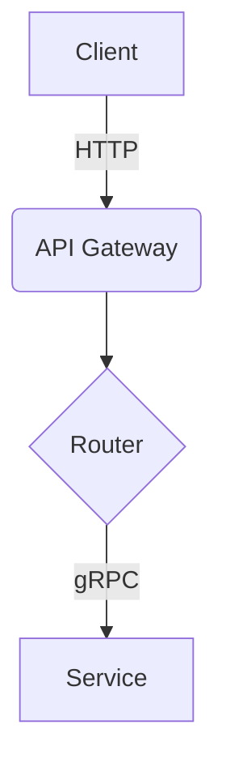

# 🏗️ Architecture Review

> [!NOTE]  
> This review should dictate the technical boundaries for the Builder agents.

## 1. System Context
<!-- Explain how this system fits into the broader ecosystem. -->

## 2. Core Components
- **Component A**: [Responsibility]
- **Component B**: [Responsibility]

## 3. Data Flow Diagram

## 4. Technology Stack Justification
<!-- Why Rust over Go? Why PostgreSQL over MongoDB? Provide evidence. -->

## 5. Identified Technical Risks
> [!WARNING]  
> List major technical hurdles (e.g., memory leaks, high latency) and mitigation strategies.
