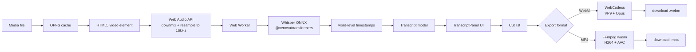

# TalkCut

A browser-based, transcript-driven video editor. All media processing—transcription, editing, and export—runs locally in the user's browser. No server upload, no API key, and no cloud transcription are required.

[](https://github.com/xzabir/talkcut/actions/workflows/ci.yml)
[](https://opensource.org/licenses/MIT)
[](https://xzabir.github.io/talkcut)

## Abstract

TalkCut is a single-page web application that lets users edit talking-head video by editing the transcript. The pipeline is: (1) a media file is selected in the browser, (2) audio is extracted locally and passed to a Web Worker for speech recognition via Whisper (ONNX runtime), (3) the resulting word-level timestamps drive an editable transcript panel synchronized to playback, and (4) user-selected deletions are exported through a WebCodecs re-encode into a WebM/VP9/Opus file or an FFmpeg.wasm encode into an MP4/H264/AAC file. All processing runs on-device; no media leaves the browser.

## Motivation

Existing transcript-driven video editors require server-side transcription and subscription pricing. Cloud processing raises privacy concerns for journalists and legal users, and network transfers limit usability for large files. TalkCut tests whether the same editing paradigm can be implemented entirely inside the browser using modern on-device APIs (WebCodecs, Web Audio, OPFS, Web Workers) and open models (Whisper via @xenova/transformers).

## Architecture



| Component | Technology | Notes |
|---|---|---|
| Build system | Vite 8, TypeScript 6.0 | Vanilla TypeScript; no React or framework runtime. |
| UI shell | DOM + CSS custom properties | Dark theme, responsive two-pane layout, resizable sidebar. |
| State | Event-based store (`src/store.ts`) | Centralized app state without a framework runtime. |
| PWA | `vite-plugin-pwa` + custom SW | Offline-capable app shell; models cached after first download. |
| Video player | HTML5 `<video>` | Drag-and-drop MP4/MOV/MKV input. |
| Audio preprocessing | Web Audio API | Decodes source audio, downmixes to mono, resamples to 16 kHz. |
| Transcription | Web Worker + @xenova/transformers | Whisper tiny/base/small English models via ONNX runtime. Word-level timestamps. |
| Transcript UI | Word spans with selection model | Playback sync, click-to-seek, drag-to-select, delete-to-cut, double-click to edit, search. |
| Cut model | `src/cut-manager.ts` | Delete-only regions with undo/redo (50-state stack). |
| Export (WebM) | WebCodecs + webm-muxer | VP9 video, Opus audio, 48 kHz resampling, stall detection. Chrome/Edge. |
| Export (MP4) | FFmpeg.wasm | H264 video, AAC audio, segment concat. All browsers. |
| Storage | OPFS | Video blob, transcript, and cut list persist across reloads. |

## Key Design Constraints

These are deliberate scope decisions for the current release, not temporary limitations:

- **Delete-only editing.** Segments can be removed from the transcript/video. No insert, replace, multi-track, or timeline-style rearrangement is supported.
- **WebM export on Chrome/Edge; MP4 export on all browsers.** WebM export uses the WebCodecs `VideoEncoder` API (Chrome/Edge only). MP4 export uses FFmpeg.wasm as a universal fallback and works in Firefox and Safari.
- **English transcription only.** The Whisper model bundle and UI are scoped to English. Additional languages are planned for a later release.
- **No AI features.** No voice cloning, AI audio enhancement, auto-captions, or generative editing.
- **Frame-level cut granularity.** Cuts are applied at the frame level via `requestVideoFrameCallback` on the video element during export. The source video is played segment-by-segment and each displayed frame is re-encoded. Cut precision is bounded by video frame rate, not keyframe interval.

## Benchmarks / Evaluation

All numbers are from the stated reference environment. The reference machine is the development environment used during the v0.2 overhaul.

| Benchmark | Result | Reference machine | Status |
|---|---|---|---|
| Whisper base model transcription speed | 66s for 28s video (2.4× real-time) | Windows 11, Chromium headless | Measured 2026-07-17 |
| WebM export speed (no cuts) | 30s for 28s video (1.1× real-time) | Windows 11, Chromium headless | Measured 2026-07-17 |
| WebM export speed (3 cuts) | 30s for 28s video | Windows 11, Chromium headless | Measured 2026-07-17 |
| A/V sync after export | Verified — audio and video aligned in output | Manual playback of exported file | Verified 2026-07-17 |
| whisper.cpp tiny model | — | — | Not yet benchmarked (model available in UI) |
| Memory footprint at export | — | — | Pending |

## Installation

```bash
git clone https://github.com/xzabir/talkcut.git
cd talkcut
npm install
npm run typecheck
npm run test
npm run build
npm run dev
```

Open `http://localhost:5173` in Chrome or Edge for WebM export, or any modern browser for MP4 export. Drag in a video, click **Transcribe**, select words and press Delete to cut, then export.

## Comparison

| Tool | Price | Local processing | Browser | Export formats | Open source |
|---|---|---|---|---|---|
| Descript | $16–50/mo + credits | No | Web beta only | MP4, GIF, social | No |
| BBC react-transcript-editor | Free | No | Component only | None | Yes, abandoned |
| autoEdit_2 | Free | No | Electron | None | Yes, abandoned |
| OpenCut | Free | Partial | Desktop / web | MP4, etc. | Yes |
| TalkCut | Free | Yes | Yes | WebM, MP4 | Yes (MIT) |

Sources: [Descript pricing](https://descript.com/pricing), [BBC react-transcript-editor](https://github.com/bbc/react-transcript-editor), [autoEdit_2](https://github.com/OpenNewsLabs/autoEdit_2), [OpenCut](https://github.com/OpenCut-app/OpenCut).

## Roadmap

| Phase | Status | Description |
|---|---|---|
| 1: Scaffold & playback | shipped | Vite PWA, video player, waveform, OPFS persistence. |
| 2: Transcription engine | shipped | Whisper via @xenova/transformers (ONNX runtime), word-level timestamps, model manager. |
| 3: Transcript UI & sync | shipped | Editable synced transcript, click-to-seek, delete-to-cut, word selection, search. |
| 4: Cut engine | shipped | Filler/silence detection, delete-only editing, undo/redo, cut visualization. |
| 5: Export | shipped | WebCodecs VP9/Opus WebM + FFmpeg.wasm H264/AAC MP4, format selector. |
| 6: Polish & launch | shipped | README, CI/CD, GitHub Pages, keyboard shortcuts, model manager, toast notifications, resizable sidebar. |
| Post-v0.2: frame-accurate GOP cutting | planned | Decode partial GOPs for sub-frame cut precision. |
| Post-v0.2: localization | planned | Non-English Whisper models. |
| Post-v0.2: speaker diarization | planned | Multi-speaker labels. |

## Citation

```bibtex
@software{talkcut2026,
  title = {TalkCut: Browser-based transcript-driven video editing},
  author = {TalkCut contributors},
  year = {2026},
  url = {https://github.com/xzabir/talkcut},
  note = {MIT License}
}
```

## License and Acknowledgments

TalkCut is released under the [MIT License](./LICENSE).

The project uses the WebCodecs API, the Web Audio API, the Origin Private File System, and FFmpeg.wasm, all standardized or open technologies. Speech recognition uses [Whisper](https://github.com/openai/whisper) models via [@xenova/transformers](https://github.com/xenova/transformers.js) (ONNX runtime). WebM muxing uses [webm-muxer](https://github.com/Vanilagy/webm-muxer). MP4 encoding uses [@ffmpeg/ffmpeg](https://github.com/ffmpegwasm/ffmpeg.wasm).

## Contributing and Security

See [CONTRIBUTING.md](./CONTRIBUTING.md) for development conventions and [SECURITY.md](./SECURITY.md) for vulnerability reporting.
