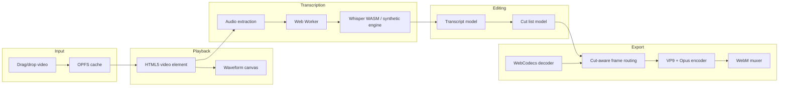

# TalkCut Architecture

This document describes the high-level architecture of TalkCut. It is intended for contributors and reviewers who need to understand the data flow and design decisions without reading every source file.

## Overview

TalkCut is a single-page browser application built with Vite and vanilla TypeScript. All media processing—transcription, editing, and export—runs inside the browser. There is no server component, no cloud API, and no telemetry.

## Source Layout

| Path | Responsibility |
|---|---|
| `src/main.ts` | Application shell, layout, keyboard shortcuts, project lifecycle. |
| `src/player.ts` | HTML5 video wrapper, drag-and-drop input, play/pause/seek. |
| `src/waveform.ts` | Canvas-based waveform renderer, playback head, cut-region shading. |
| `src/audio-extractor.ts` | Web Audio API extraction: decode, downmix, resample to 16 kHz. |
| `src/transcription-worker.ts` | Web Worker entry point for speech recognition. v0.1 uses a synthetic engine; the real whisper.cpp/WASM integration is planned for the next release. |
| `src/transcription-service.ts` | Worker lifecycle, model loading, and progress orchestration. |
| `src/transcribe-button.ts` | Transcription trigger UI and progress bar. |
| `src/transcript-panel.ts` | Editable, playback-synced transcript display. |
| `src/cut-manager.ts` | Cut list model with undo/redo and filler/silence detection. |
| `src/cuts-panel.ts` | Sidebar UI for cut management. |
| `src/exporter.ts` | WebCodecs decode → cut routing → VP9/Opus re-encode → WebM muxer. |
| `src/export-panel.ts` | Export UI with progress, error handling, and capability detection. |
| `src/opfs.ts` | OPFS wrappers for video blob and project JSON persistence. |
| `src/types.ts` | Shared TypeScript interfaces. |

## Data Flow

1. **Video load.** A file is dropped onto the player. The blob is saved to OPFS; a `ProjectState` is created; the waveform is generated from the audio track.
2. **Transcription.** Audio is extracted and sent to the worker. The worker returns word-level timestamps, which are stored in `ProjectState.transcript` and rendered in the transcript panel.
3. **Editing.** The user edits text, deletes segments, or applies filler/silence removal. `CutManager` maintains the authoritative `CutRegion[]` list and emits change events.
4. **Export.** The source file is decoded frame-by-frame. Frames inside cut regions are dropped; remaining frames are re-encoded with adjusted timestamps. The audio track is processed the same way. The output is muxed into WebM and downloaded.

## Key Design Decisions

- **Vanilla TypeScript.** No framework runtime reduces bundle size and keeps the project approachable for systems-oriented contributors.
- **Worker-based transcription.** Speech recognition is offloaded to a Web Worker to avoid blocking the UI during long audio.
- **OPFS persistence.** Project state and media survive page reloads without a server.
- **Cut list as the single source of truth.** The UI and export pipeline both read from `CutManager`, so visual feedback and output are consistent.
- **Delete-only editing.** The model only supports removal operations, which simplifies the data model and export pipeline for the v0.1 release.
- **Keyframe-boundary cuts (v0.1).** Export snaps cuts to the nearest keyframe rather than decoding partial GOPs, trading precision for simplicity and speed.

## Browser APIs Used

- WebCodecs (`VideoDecoder`, `VideoEncoder`, `AudioDecoder`, `AudioEncoder`, `EncodedVideoChunk`, `AudioData`)
- Web Audio API (`AudioContext.decodeAudioData`)
- Origin Private File System (`navigator.storage.getDirectory`)
- Web Workers (`Worker` with `type: 'module'`)
- Service Workers (via `vite-plugin-pwa` for offline caching)

## Testing

Unit tests live in `tests/` and run with Vitest. The current tests focus on deterministic, pure logic such as `CutManager`. Browser-dependent APIs (Web Audio, WebCodecs, OPFS) are tested manually in the target browser.

## Future Work

See the README roadmap for planned features: real whisper.cpp/WASM integration, frame-accurate GOP cutting, Firefox/Safari export fallbacks, and non-English transcription.
